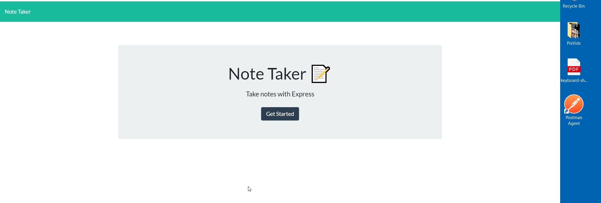

# Note Taker via express

## Note Taker

Modify starter code to create an application called Note Taker that can be used to write and save notes. This application will use an Express.js back end and will save and retrieve note data from a JSON file.

The application’s front end has already been created. It's your job to build the back end, connect the two, and then deploy the entire application to Heroku.

## Picture of Main Notes pg

## Picture of Note pg

## Link to deployed Heroku page
[Deployed Page](https://pfdpostitnote.herokuapp.com/notes)

## Link to Github repo
[Github repo](https://pfdemarco.github.io/postITNote/)